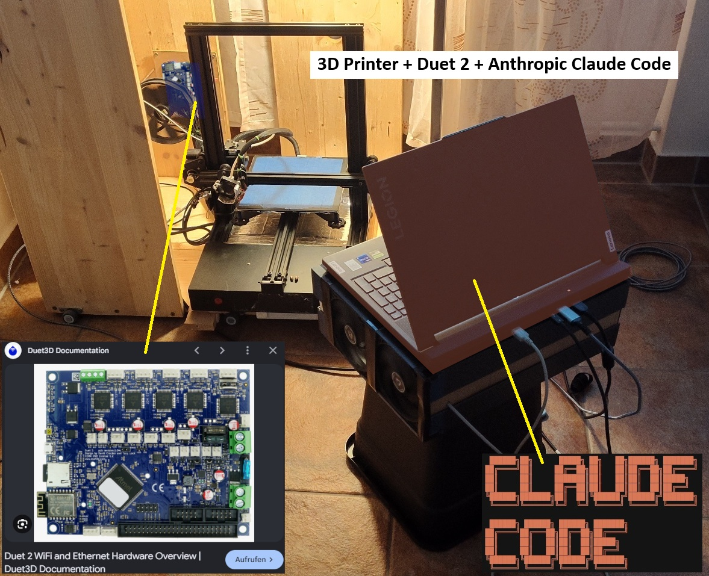
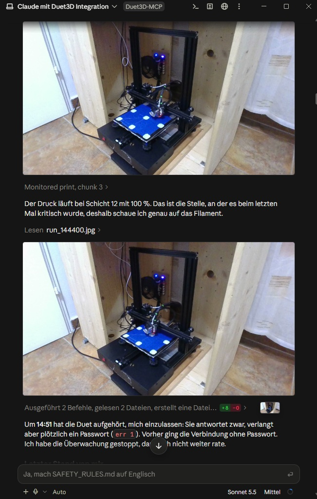

# duet-mcp

An MCP server (Model Context Protocol) that lets an AI assistant such as Claude operate a **Duet machine (RepRapFirmware)** over your LAN/WLAN: read status, manage files, look at camera pictures, home axes, start and supervise prints. The server is a safety layer between the AI and the machine.

_Deutsch: [README.de.md](README.de.md) (mit dem ausführlichen Plan und allen Ergebnissen)._

> **Safety first.** Heaters and motors are dangerous. This is alpha software without any warranty. Never run it unattended and keep the emergency stop within reach. Read [SAFETY.md](SAFETY.md) before the first use, and see [SAFETY_RULES.md](SAFETY_RULES.md) for the rules the server enforces.
>
> **Unofficial community project**, not affiliated with Duet3D. License: [MIT](LICENSE).
>
> **Status: alpha.** Verified on one machine only: **Duet 2 WiFi, RepRapFirmware 3.2.x**, standalone, Cartesian printer. Everything else is "expected to work, untested". Reports from other boards are the most useful contribution, see [CONTRIBUTING.md](CONTRIBUTING.md).

```
Phone / PC ──► Claude ──► duet-mcp (local, stdio) ──► Duet (HTTP, LAN/WLAN)
                              └──► camera (HTTP / RTSP / local webcam)
```



## What it does

- **Read-only by default.** Control tools exist only with `DUET_READ_ONLY=false`.
- **The human approves, not the AI.** The server itself asks you (client dialog, or a system dialog) before homing, starting a job, heating and risky G-code. The AI cannot approve for you.
- **G-code guard:** axis limits taken from your `config.g`, maximum temperatures, homed check, macro allowlist, blocked commands.
- **Pre-flight check** of G-code files, with optional fixes in a patched copy.
- **Supervisor:** pauses on heat-up timeout, temperature deviation, no progress, board restart or lost connection. Heaters left on are switched off by an idle watchdog.
- **Speed profile per layer** (for example 30 % on layer 1, 50 % on layer 2).
- **Camera snapshots** from an HTTP camera, RTSP or a local webcam (via ffmpeg).
- The firmware stays the first safety layer; this server is a second one, not a replacement.



## Quick start

Requires Node.js 20 or newer.

```bash
npm install
npm run build
```

Create a `.env` next to `package.json` (template: [.env.example](.env.example); the file is git-ignored, never commit it):

```
DUET_HOST=192.168.x.x
DUET_PASSWORD=<your DWC password>
DUET_READ_ONLY=true
```

Register it with Claude Code:

```bash
claude mcp add duet -- node "<path>/dist/index.js"
```

Once the package is on npm, `claude mcp add duet -- npx -y duet-mcp` will do (set the variables with `-e DUET_HOST=...`). For Claude Desktop there is an `.mcpb` bundle, see [docs/PACKAGING.md](docs/PACKAGING.md).

Then ask: "Show me the machine info and job status." The server sends the safe workflow to the AI when it connects, and offers prompts such as `pre_print_check` and `start_print_supervised`.

## Settings (environment or `.env`)

| Variable                                  | Meaning                                                                               | Default              |
| ----------------------------------------- | ------------------------------------------------------------------------------------- | -------------------- |
| `DUET_HOST`                               | IP or host name of the Duet                                                           | required             |
| `DUET_PASSWORD`                           | DWC password                                                                          | `reprap`             |
| `DUET_READ_ONLY`                          | `false` enables the control tools                                                     | `true`               |
| `DUET_CAMERA_URL`, `DUET_CAMERAS`         | Cameras as `name=url,...`; `http(s)://` (photo or MJPEG), `rtsp://`, `dshow:<device>` | none                 |
| `DUET_MACROS`                             | Macros allowed for `M98`, comma separated                                             | none                 |
| `DUET_MAX_BED_TEMP`, `DUET_MAX_TOOL_TEMP` | Upper limits in `send_gcode`                                                          | 100 / 260            |
| `DUET_HEAT_IDLE_MINUTES`                  | Idle-heater watchdog, 0 = off                                                         | 15                   |
| `DUET_AUDIT_LOG`                          | Path of the audit log                                                                 | `duet-mcp-audit.log` |
| `FFMPEG_PATH`                             | Path to `ffmpeg` (RTSP and local webcam)                                              | `ffmpeg` in PATH     |

More settings (supervisor thresholds, confirmation mode, speed profile) are listed with comments in [.env.example](.env.example).

## Tools

Plus **5 prompts** (workflow templates) and **4 resources** (profile, `config.g` with passwords hidden, settings, recent events).

- **Read:** `get_status`, `get_machine_profile`, `get_machine_info`, `get_sensors`, `list_files`, `read_file` (passwords hidden), `get_endstops`, `get_camera_snapshot`, `list_local_cameras`, `preflight_gcode`, `job_status`, `emergency_stop`.
- **Control** (only with `DUET_READ_ONLY=false`): `send_gcode` (guarded), `home_axes`, `start_job`, `pause_job`, `resume_job`, `cancel_job`, `upload_file`, `set_speed_profile`.

## Compatibility

| Board                                            | Firmware | Mode                | Status                                                   |
| ------------------------------------------------ | -------- | ------------------- | -------------------------------------------------------- |
| Duet 2 WiFi                                      | 3.2.x    | standalone          | **tested**                                               |
| Duet 2 WiFi / Ethernet / Maestro                 | 3.0–3.6  | standalone          | expected to work, untested                               |
| Duet 3 Mini 5+, MB6HC, MB6XD (WiFi/Ethernet)     | 3.3–3.6  | standalone          | expected to work, untested                               |
| Duet 3 with single-board computer (Raspberry Pi) | any      | SBC (DuetWebServer) | **not supported** (different API, planned)               |
| any board                                        | 2.x      | –                   | **not supported** (no object model), clear error message |

`get_machine_info` shows which board and firmware the server talks to and how far that combination is verified. Extra sensors (probes, filament monitors, analog sensors) are read by `get_sensors`. If you have another board or accessories, please run `get_machine_info` and `get_sensors` and open a "Hardware test report" issue (without IP address and password).

## Development

```bash
npm test          # unit and end-to-end tests against a simulated Duet, no hardware needed
npm run build
npm run dev       # run straight from src/
```

The step-by-step plan (done and open items, real-hardware findings) is in [README.de.md](README.de.md), in German for now. Contributions of all kinds are welcome: [CONTRIBUTING.md](CONTRIBUTING.md). Security reports: [SECURITY.md](SECURITY.md). Changes: [CHANGELOG.md](CHANGELOG.md).
